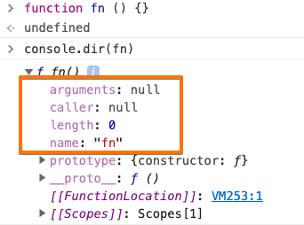

함수는 다양한 분야에서 다양한 형식으로 정의됩니다.\
적어도 자바스크립트에서 함수를 간단히 정리하면 아래정도가 될 것 같네요 :)


> 값을 입력받아 다른 값을 반환하는 코드의 묶음(또는 블럭)


*"값을 반환하지 않는 함수가 있지않나요?"* 라고 생각할 수 있습니다.\
그러나 정확히는 값을 반환하지 않는게 아니라, 반환하는 값이 undefined라고 이해하는게 맞다고 생각해요 :)

종종 다른언어(ex. PL/SQL)들은 return이 없는 코드묶음을 프로시저라는 분류로 나누기도 합니다.

### 함수도 값이다!

다른 언어들도 마찬가지지만, 자바스크립트에서 [값으로 인식되는 데이터](https://developer.mozilla.org/ko/docs/Web/JavaScript/Data_structures)들은 모두 변수에 담을 수 있습니다.

그리고 Javascript는 **함수도 값**으로 인식합니다.\
<small>조금 고급진 말로 "Javascript에서 함수는 [일급객체](https://soeunlee.medium.com/javascript%EC%97%90%EC%84%9C-%EC%99%9C-%ED%95%A8%EC%88%98%EA%B0%80-1%EA%B8%89-%EA%B0%9D%EC%B2%B4%EC%9D%BC%EA%B9%8C%EC%9A%94-cc6bd2a9ecac)다!"라고 표현하기도 합니다.</small>

함수를 값으로 인식하기 때문에 다음과 같은 코드들이 가능합니다 :)


```js
// primitive 한 '값'들
const a = 10
const b = true
const c = 'c'
const d = undefined
const e = null

// 함수도 '값'
const x = function() {}
const y = function(a) {}

// 파라미터(변수)에 함수넣기
y(x)
```

## 함수 만들기

함수는 다양한 방법으로 만들 수 있습니다.

방법에 대해 알아보기 전에, **식(expression)**과 **문(statement)**과 대해 잠깐 짚고 넘어가겠습니다!

**식(expression)**은 값을 return하는 코드를 의미합니다. 대표적인 예로로는 `함수표현식`, `정의식` 등이 있습니다.

return 하는 값이 있기때문에 이 값을 담을 변수가 필요합니다.\
변수가 없다면 사실 무의미한 코드라고 볼 수도 있습니다.
```js
10 // 10을 return
true // true를 return 
1 + 1 // 2를 return 
```

**문(statement)**은 식과 반대로 값을 return하지 않는 코드를 의미합니다.\
대표적인 예로는 `반복문`, `조건문`, `대입문` 등이 있습니다. 
```js
// 조건문
if () {  /* do something */ }
// 반복문
for (const i = 0; i < 5: i++) { /* do something */ }
// 대입문
const a = 1 + 1

// 에러발생 (변수에 담을 값이 없기 때문)
const b = if () {  /* do something */ }
const c = for (const i = 0; i < 5: i++) { /* do something */ }
```

이 이야기를 먼저 드렸던 이유는 함수를 **문**과 **식** 두가지의 형태로 만들 수 있기 때문입니다.

### 문(Statement)형태의 방법

함수도 리터럴이 있는데요, **함수선언문** 이라고 부릅니다.

```js
function sum (a, b) { return a + b; }
```

### 식(Expression)형태의 방법

식(Expression) 형태의 방법들로는 **함수표현식**과 **생성자**를 이용한 방법이 있습니다.

함수표현식은 자주 사용하지만, 생성자는 조금 생소할 수 있는데요.

javascript는 모든것들이 객체이기에, 함수 또한 객체입니다.\
함수도 객체라면 함수생성을 위한 클래스가 있겠지요?\
생성자를 이용한 방법은 이 Function 클래스를 이용한 생성방법입니다.

```js
// 함수표현식을 이용
const sum1_1 = function (a, b) { return a + b }
const sum1_2 = function fn (a, b) { return a + b } // 함수선언문처럼 생겼지만, 자바스크립트엔진에 의해 함수선언식으로 변환되어 동작합니다.
const sum1_3 = (a, b) => { return a + b } // arrow function

// 생성자를 이용
const sum2 = new Function('a', 'b', 'return a + b') 
```

### 함수선언문 vs 함수표현식

이 둘은 [호이스팅](/javascript/호이스팅)이 발생했을때 큰 차이가 나타납니다.\
<small>호이스팅은 선언문 코드가 제일 먼저 수행되는 자바스크립트의 메커니즘입니다.</small>

**함수선언문**은 값을 담는 **변수의 선언과 변수에 값을 할당하는 초기화가 함께 진행**되고,  **함수표현식**은 변수의 선언과 초기화가 각각 **단계별로 나누어져 진행**됩니다.

따라서 호이스팅이 발생했을 때, 함수선언문은 최상단에서 초기화가 되는 반면, 함수표현식은 선언만 수행됩니다.

이는 결국 호출가능시점의 차이로 이어지게되어, **함수선언문으로 만들어진 함수는 코드 위치에 상관없이 어디서든 호출이 가능**하며 함수표현식은 불가능하게 됩니다.

```js
fnByStatement(); // I'm a function made by statement
fnByExpression(); // Uncaught ReferenceError: Cannot access 'fnByExpression' before initialization

function fnByStatement () {
    console.log('I\'m a function made by statement');
}

const fnByExpression = function () {
    console.log('I\'m a function made by expression');
}
```

### 어떤걸 써야할까?

개인의 취향이라는 생각이 듭니다.

저도 함수를 정의할때마다 고민을 해왔는데요, 저는 함수선언문보다 **함수표현식을 애용**하려 합니다.

일각에서는 코드의 직관성과 가독성을 떨어뜨릴수 있는, 호이스팅이 일어나는 **함수선언문을 지양하자**고도 하는데요.\
저도 이 의견에 동의합니다.

뿐만 아니라 javascript에서는 함수도 일급객체로 취급되는만큼, 다른 일급객체들과 동일하게 표현식을 이용해서 정의하는게 일관성이 있지않나하는 생각이 듭니다.


## 함수에만 있는 속성
javascript는 객체지향프로그래밍을 지원하는 언어입니다.\
그렇기에 함수도 객체 형태로 존재하게되고, 속성값을 갖습니다.



### Function.~~arguments~~
사라질 예정인 속성값입니다.

함수에 넘겨진 매개변수값들을 저장하고 있는 속성값입니다.\
이 값은 [```Arguments```](https://developer.mozilla.org/ko/docs/Web/JavaScript/Reference/Functions/arguments) 라는 객체이며, ```Array```와 비슷한 형태로 데이터를 저장하고 있습니다.


```Arguments```는 ```Array```와 다른 객체입니다.\
겉보기에 데이터를 저장하는 형태는 Array와 비슷해보일 수 있지만, 당연히 Array 객체가 갖고잇는 ```map```, ```forEach```와 같은 메소드들은 사용할 수 없습니다.

```js
function testFn (a, b, c) {
    console.log(testFn.arguments);
}

testFn() // Arguments [callee: ƒ, Symbol(Symbol.iterator): ƒ]
testFn(1, 2) // Arguments(2) [1, 2, callee: ƒ, Symbol(Symbol.iterator): ƒ]
testFn(1, 2, 3) // Arguments(3) [1, 2, 3, callee: ƒ, Symbol(Symbol.iterator): ƒ]
testFn(1, 2, 3, 4, 5) // Arguments(5) [1, 2, 3, 4, 5, callee: ƒ, Symbol(Symbol.iterator): ƒ]
```

사라질 예정이기에 대안으로 사용될만한 방법들을 소개합니다!

#### arguments
```Function.arguemnts```와 동일하게 ```Arguments```객체를 담고있는 변수입니다.\
Arguments이 저장하고있는 값의 형태가 동일할뿐, 이 둘이 같은 참조값을 가지고있진않습니다.

함수내에서 지역변수형태로 사용할 수 있습니다.

```js
function testFn (a, b, c) {
    // testFn.arguments === arguments -> false
    console.log(arguments);
}

testFn() // Arguments [callee: ƒ, Symbol(Symbol.iterator): ƒ]
testFn(1, 2) // Arguments(2) [1, 2, callee: ƒ, Symbol(Symbol.iterator): ƒ]
testFn(1, 2, 3) // Arguments(3) [1, 2, 3, callee: ƒ, Symbol(Symbol.iterator): ƒ]
testFn(1, 2, 3, 4, 5) // Arguments(5) [1, 2, 3, 4, 5, callee: ƒ, Symbol(Symbol.iterator): ƒ]
```

#### rest 파라미터
입력받은 파라미터를 Array객체로 얻어올 수 있도록 합니다.

다음은 arguments 변수와의 차이점입니다.

- ```Arguments``` 객체가 아닌 ```Array``` 객체의 형태
- arguments는 전체 파라미터값을 배열로 갖고있는반면, rest파라미터는 전체 파라미터 값이 아닌 rest파라미터가 선언된 순서 이후의 파라미터들에 대해서만 배열로 갖고있음

```js
function testFn (a, b, ...rest) {
    console.log(rest);
}

testFn() // []
testFn(1, 2) // []
testFn(1, 2, 3) // [3]
testFn(1, 2, 3, 4, 5) // [3, 4, 5]
```

### Function.~~caller~~
사라질 예정인 속성값입니다.

자신을 호출한 함수를 의미합니다.\
자신의 바로 상위 콜스택을 의미한다고 볼 수도 있겠네요!

```js
function testFn1 () {
    console.log(testFn1.caller)
    testFn2()

    function testFn2 () {
        console.log(testFn2.caller)

        testFn3()
        function testFn3() {
            console.log(testFn3.caller)
        }
    }
}

testFn1()
/**
 * Call Stack
 *      testFn1() -> testFn2() -> testFn3()
 * 
 * Output
 *      null
 *      f testFn1() {...}
 *      f testFn2() {...}
 * /

```


### Function.length
함수에 정의된 파라미터의 갯수입니다.\
타입검사가 느슨하기때문에, 파라미터의 갯수를 지키지않는다고해서 에러가 발생하지는 않습니다.

```js
function testFn (a, b, c) {
    console.log(testFn.length)
}

testFn() // 3
testFn(1, 2, 3) // 3
testFn(1, 2, 3, 4) // 3
```

### Function.name
함수의 이름입니다.

```js
function testFn () {
    console.log(testFn.name)
}

testFn() // 'testFn'
```


## 사용용도에 따른 종류

자바스크립트에는 함수를 다양한 형태로 사용하는데요! 대표적인 종류와 용도에 대해 정리해보겠습니다.

### 즉시실행함수
말 그대로 **정의과 동시에 즉시 실행이 되는 함수**입니다.\
함수선언식이 return한 값을 변수에 담지않고 그대로 실행시키는 원리입니다.

처음 한번만 실행되어야 하는 로직(ex 모듈이나 네임스페이스 초기화 등..)의 수행을 위한 용도로 많이 사용됩니다.\
특히 모듈패턴을 구현할때 유용하게 사용할 수 있는 함수형태입니다.


```js
// 사용예시
(function(name) {
    console.log(`안녕하세요 ${name}님!, 즉시실행함수가 호출되었습니다!`)
}('GINAMEEE'));

// 간단한 모듈패턴
const chunJS = (function() {
    const name = 'chun';
    
    function sayHello () {
        console.log(sayHello);
    }

    return {
        name,
        sayHello
    };
}())
```

### 고차함수
**파라미터로 함수를 받거나** 또는 **함수를 return하는** 함수를 고차함수라고 합니다.\
이미 정의된 함수에 추가기능을 덧붙이거나, 특정로직에 다양한 동작을 유연하게 끼워넣고 싶을때 사용할 수 있습니다.\
[React의 HoC](https://ko.reactjs.org/docs/higher-order-components.html)나, 비동기작업에서 콜백함수를 넘기는 방식도 고차함수의 활용방법 중 하나입니다.

고차함수를 사용하면 함수를 더 유연하게 사용할 수 있습니다.

대표적인 장점으로는,\
다양한 함수에서 공통으로 반복되는 로직을 고차함수로 따로 분리할 수 있는데요.\
반복되는 로직의 수정이 필요할 때 다른코드의 수정없이 고차함수의 내용만 변경해주면 되므로 유지보수가 편리해집니다.

```js
// 일반함수
function repeat (times, value) {
    return Array(times).fill(0).map(() => value);
}
/* 
고차함수를 활용
    action을 파라미터로 받음으로써 위의 repeat함수보다 더 다양한 동작을 수행할 수 있습니다.
*/
function repeatedly(times, action) {
    return Array(times).fill(0).map(action);
}
```

```js
// 일반함수
function say (word) {
    console.log('=====');
    console.log(`${word}.`);
}

function whisper (word) {
    console.log('=====');
    console.log(`${word}...`);
}

say();
whisper();

/* 
고차함수를 활용
    '====='을 출력하는 공통로직을 고차함수로 분리함으로써, 
    추후에 '=====' -> '-----'로 바뀐다면 고차함수만 변경해주면 됩니다.
*/
function say (word) {
    // console.log('=====');
    console.log(`${word}.`);
}

function whisper (word) {
    // console.log('=====');
    console.log(`${word}...`);
}

function tellWithHr (tell) {
    console.log('===');
    return tell
}

tellWithHr(say)(word)();
tellWithHr(whisper)(word)();
```


### 생성자함수
new 연산자와 함께 사용되는 함수로, **return 값을 정의하지 않는 형태의 함수**입니다.\
정의하지 않을 뿐이지 당연히 값은 return 합니다!

인스턴스객체의 구조를 정의하기 위해 사용되는데요,

말이 조금 어렵지요..?\
특정 객체를 일관된 형태로 정의해주기위해서 사용하는 함수라고 생각을 하시면 됩니다.

조금 더 설명하자면, 자바스크립트는 약한타입의 언어라고들 하는데요!\
이는 값의 타입을 느슨하게 관리한다는 의미입니다.\
변수나 함수의 파라미터를 정의할 때 값의 타입을 미리 정의해줄 필요가 없는게 대표적인 예라고 볼 수 있습니다.

따라서 데이터를 정의했을 때, \
내가 원하는 타입으로 제대로 생성이 되었는지 매번 일일이 검사해야하는 불편함이 존재합니다.

그러나 데이터의 정의를 생성자라고하는 함수에게 위임함으로써 완전한 형태의 생성을 보장합니다.\
(데이터 정의를 자동화해주는 함수라고 생각해도 좋을 것 같네요)

```js
function foo() {
  this.fds = 10; // 동적 바인딩을 이용하여, 빈 객체에 속성들을 추가한다.
}
 
const y = new foo();
 
console.log(y instanceof foo); // true, 완벽한 타입을 보장
```

위의 코드는 아래의 순서대로 동작합니다.

1. new 연산자가 빈 객체를 생성하고 foo 함수에 전달한다. (5 라인)
2. 전달된 빈 객체는 foo에서 this로 접근가능하다. (1~3 라인)
3. 동적 바인딩을 이용하여 빈객체의 fds프로퍼티를 추가하고 값을 10으로 설정한다. (2 라인)
4. 빈 객체를 return 하여 y에 저장한다. (5 라인)

ES6부터는 이러한 작업을 명시적으로, 그리고 가독성좋게 개발할 수 있도록 **class** 라는 키워드를 제공합니다.

```js
/**
  * foo vs bar
  * 눈에 보이는게 다르다.
  * constructor()가 눈에 들어나있다.
  * foo는 new연산자 없이 호출 가능, bar는 호춟 불가.
  * foo는 new 연산자 없이 호출이 가능하기때문에, 개발자들이 생성자의 앞글자를 대문자로 만드는 convention 만들었다.
  * bar는 그런 노력이 필요없다!
  */

 class bar {
   // 생성자, 객체를 찍어낸다. ( == foo 함수)
   constructor() {
     this.name = 10;
   }
 }
 
 const obj2 = new bar();
```

물론 어떤 기준으로 분류하느냐에 따라 더 많은 함수의 종류가 있을 수 있습니다.\
댓글로 남겨주시면 추후에 포스팅해보도록 하겠습니다! :)


처음 포스팅을 어떤걸로 할지 고민을 많이 했는데요!\
가장 기본적이면서도 중요한 그러나 놓치기 쉬운 **함수**에대해서 간단히 정리해보았습니다.\
정리하면서 한번 더 이해하게 되는 좋은 시간이었습니다 :)

## 참고문헌
- https://developer.mozilla.org
 - https://hogni.tistory.com/148
 - https://velog.io/@moonsun116/%EC%9E%90%EB%B0%94%EC%8A%A4%ED%81%AC%EB%A6%BD%ED%8A%B8-%ED%95%A8%EC%88%98%EC%A0%95%EB%A6%AC
 - https://shyunju7.tistory.com/entry/JavaScript-07-%ED%81%B4%EB%A1%9C%EC%A0%80
 https://velog.io/@recordboy/%EC%9E%90%EB%B0%94%EC%8A%A4%ED%81%AC%EB%A6%BD%ED%8A%B8-%EB%AA%A8%EB%93%88-%ED%8C%A8%ED%84%B4
 - https://poiemaweb.com/js-array-higher-order-function